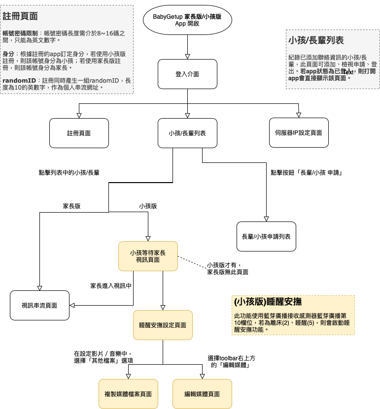
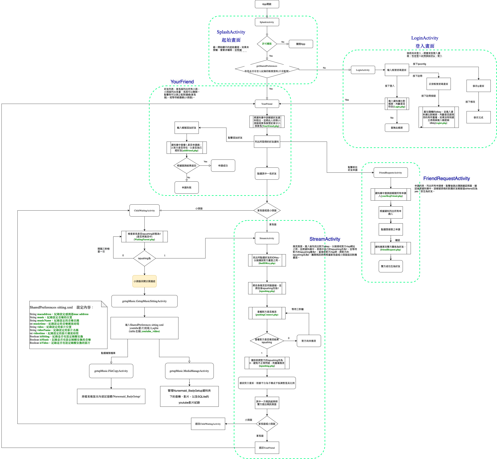
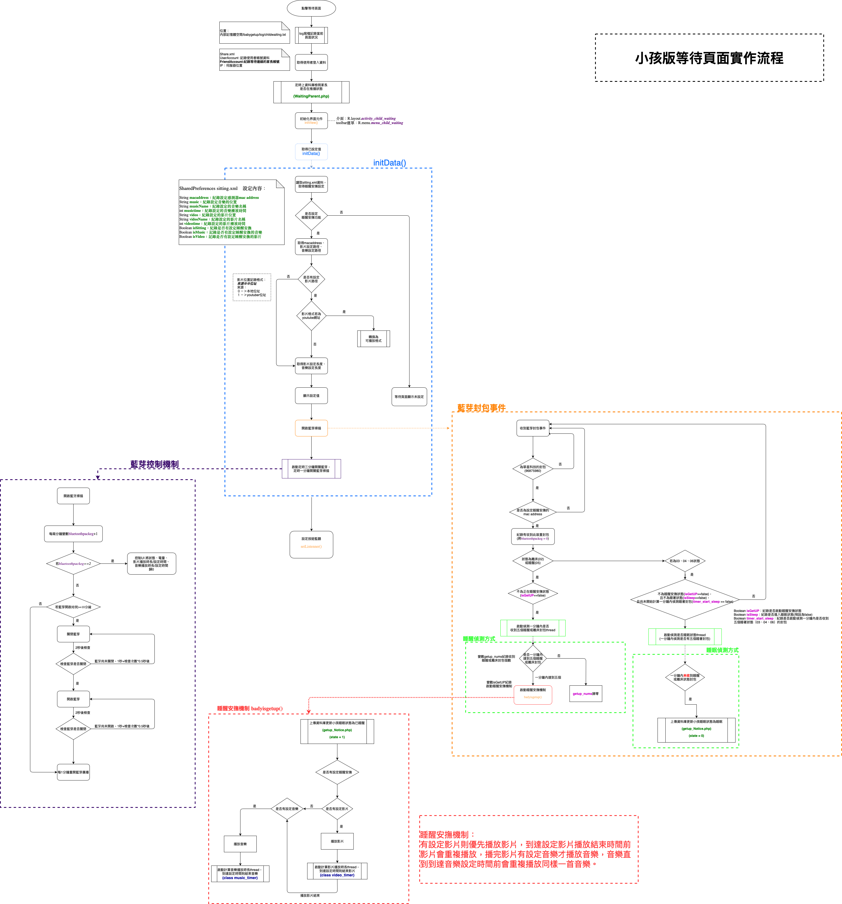

<p align="center">
  
</p>

<h1 align="center">👶 BabyGetUp — 智慧嬰兒監護系統</h1>

<p align="center">
  <strong>結合 BLE 感測器、即時視訊串流與自動睡醒安撫功能的智慧嬰兒監護方案</strong>
</p>

<p align="center">
  
  
  
  
  
</p>

<p align="center">
  <a href="https://oomao.github.io/BabyGetup_ShowCase/demo/">🌐 線上Demo</a> •
  <a href="https://play.google.com/store/apps/details?id=org.easydarwin.easypusher_ap">📱 家長端 App</a> •
  <a href="https://play.google.com/store/apps/details?id=org.easydarwin.nursemaidgetupsetting_ap">📱 小孩端 App</a>
</p>

---

## 📖 專案簡介

**BabyGetUp** 是一套完整的智慧嬰兒監護系統，協助照護者透過即時視訊串流與 BLE（低功耗藍牙）感測器數據，遠端監控嬰幼兒的狀態。系統提供兩種部署架構 — **AP 模式**（裝置直連）與 **WAN 模式**（透過網路），可在不同環境靈活使用。

> ⚠️ **聲明**：基於保密協議，本倉庫不包含原始碼。此 Showcase 展示系統架構、功能特色與技術文件。

---

## ✨ 核心功能

### 📹 即時視訊監控
- 家長與小孩端 1 對 1 視訊串流（**WebRTC**）
- 低延遲點對點連線
- 根據網路狀況自適應調整視訊品質

### 🌡️ BLE 感測器整合
- **溫度**監測（°C）
- **濕度**追蹤（%）
- **呼吸頻率**偵測（bpm）
- 透過 BLE 5.0 穿戴式感測器即時取得數據
- 自定義 BLE 封包解析（PID03、PID06 格式）

### 🎵 睡醒安撫系統
- 透過 BLE 感測器自動偵測（離床與睡眠狀態）
- 可設定自動播放音樂和影片進行安撫
- 優先播放機制（影片優先，接著播放音樂）
- 音量與計時器控制

### 👥 聯絡人管理
- 家長/小孩角色帳號系統
- 好友申請與審核流程
- 隨機 ID 產生用於串流網址
- 多國語言支援（繁體中文、簡體中文、English）

### 🔐 安全機制
- JWT（RS256）Token 驗證
- JKS Keystore 用於 Android App 簽章
- FCM 推播通知
- SSL/TLS 加密通訊

---

## 💡 核心技術挑戰與突破 (Key Technical Achievements)

在開發此商業級別 App 的過程中，我主導並解決了以下關鍵技術難點：

### 1. 藍牙封包防抖動與精準判定 (BLE Packet Debouncing)
為避免穿戴式裝置因外界干擾或連線不穩造成狀態誤判，我實作了**條件式緩衝機制**。系統會持續攔截並驗證封包，必須連續確認 5 個「睡醒」或「離床」的藍牙封包後，才會正式觸發推播與自動安撫媒體播放。此機制大幅過濾了雜訊，確保安撫系統的穩定性與準確率。

### 2. WebRTC 複雜網路穿透與自動接聽 (NAT Traversal)
為了讓家長能隨時一鍵查看小孩狀況，小孩端實作了**無縫背景自動接聽機制**。在 P2P 連線建立過程中，我深入處理了 SDP (Session Description Protocol) 握手與 ICE Candidate 收集流程，確保家長與小孩即使身處不同網路層（例如 4G LTE 對家用 Wi-Fi），也能透過 STUN/TURN 協定順利穿透 NAT，成功建立低延遲、高清晰度的視訊通道。

### 3. Socket.IO 生命週期與斷線重連優化 (Lifecycle & Reconnection)
Android 系統的電池最佳化常會導致背景 App 網路活動受限，造成 Socket.IO 因 Timeout 而強制斷線。為此，我在 Activity 的 `onRestart` 等生命週期回呼中，實作了精準的狀態檢測與**自動重連機制 (Auto-reconnect)**。當應用程式重新切回前台時，系統能瞬間無感恢復連線，保障了房間信令的高可用性。

### 4. FCM Token 效能管理與淘汰機制 (Token Lifecycle Management)
為解決開發測試與使用者重裝 App 導致資料庫堆積無效 FCM (Firebase Cloud Messaging) Token 的問題，我設計了**動態 Token 淘汰過濾器**。每次發起推播任務前，系統會自動核對並清理超過兩個月未活躍的無效 Token，並於 App 每次啟動時更新活躍時間戳記。這大幅減輕了資料庫的檢索負載，並消除了推播延遲的隱患。

---

## 🏗️ 系統架構

### AP 模式（直連）
適用於無網路環境，使用 Wi-Fi Direct 傳輸視訊，使用藍牙接收感測器數據。

```
┌──────────────┐     BLE 5.0      ┌──────────────┐
│  BLE 感測器   │ ◄──────────────► │   小孩手機    │
│  （穿戴裝置）  │                  │  (Android)   │
└──────────────┘                  └──────┬───────┘
                                         │ Wi-Fi Direct / AP
                                  ┌──────┴───────┐
                                  │   家長手機    │
                                  │  (Android)   │
                                  └──────────────┘
```

### WAN 模式（網路連線）
適用於遠端監控，使用 WebRTC 進行視訊串流，Node.js 作為信令伺服器。

```
┌──────────────┐     BLE      ┌──────────────┐
│  BLE 感測器   │ ◄──────────► │   小孩手機    │
│  （穿戴裝置）  │              │  (Android)   │
└──────────────┘              └──────┬───────┘
                                      │ WebRTC + Socket.io
                              ┌───────┴────────┐
                              │   信令伺服器     │
                              │   (Node.js)    │
                              └───────┬────────┘
                                      │ WebRTC + Socket.io
                              ┌───────┴────────┐
                              │    家長手機      │
                              │   (Android)    │
                              └───────┬────────┘
                                      │ HTTPS
                              ┌───────┴────────┐
                              │   API 伺服器    │
                              │ (PHP + MySQL)  │
                              └────────────────┘
```

### 詳細流程圖

<p align="center">
  
</p>

<details>
<summary>📋 點擊查看完整 App 流程圖</summary>
<br>
<p align="center">
  
</p>
</details>

<details>
<summary>📋 點擊查看小孩版等待頁面流程</summary>
<br>
<p align="center">
  
</p>
</details>

---

## 🛠️ 技術棧

| 層級 | 技術 | 用途 |
|:---:|:---:|:---|
| 📱 **行動端** | Android (Java) | 家長端 & 小孩端 App |
| 📡 **BLE** | Bluetooth 5.0 | 感測器數據通訊 |
| 🎥 **視訊** | WebRTC | 即時點對點視訊串流 |
| 🔌 **信令** | Node.js + Socket.io | WebRTC 信令與房間管理 |
| 🌐 **API** | PHP (Apache/AppServ) | RESTful API、身份驗證、使用者管理 |
| 💾 **資料庫** | MySQL (InnoDB) | 使用者資料、FCM Token、好友關係 |
| 🔑 **驗證** | JWT (RS256) | Token 驗證機制 |
| 📩 **推播** | Firebase Cloud Messaging | 推播通知 |
| 🔒 **SSL** | OpenSSL | HTTPS 加密 |
| 🔄 **程序管理** | PM2 | Node.js 進程管理與自動重啟 |

---

## 📱 App 版本

### AP 版（直連 / 藍牙）
適用於無網路環境。使用 Wi-Fi Direct 傳輸視訊、使用藍牙連接感測器。

<p align="center">
  <a href="https://play.google.com/store/apps/details?id=org.easydarwin.easypusher_ap">
    
  </a>
  <a href="https://play.google.com/store/apps/details?id=org.easydarwin.nursemaidgetupsetting_ap">
    
  </a>
</p>

### WAN 版（網路 / WebRTC）
適用於遠端監控。使用 WebRTC 進行視訊串流，Node.js 信令伺服器管理連線。

---

## 🎮 線上 Demo

透過互動式網頁 Demo 體驗 BabyGetUp 的介面：

🔗 **[開始體驗 →](https://oomao.github.io/BabyGetup_ShowCase/demo/)**

Demo 模擬了 App 的主要畫面，包含：
- 🏠 啟動畫面 & 登入 / 註冊
- 👥 模式選擇（家長 / 小孩）
- 📹 視訊通話介面（含計時器與控制按鈕）
- 🌡️ 即時感測器數據展示（溫度、電量、狀態模擬）
- 🎵 影音播放設定（音樂、影片、YouTube）
- 📋 側邊導覽選單

> *注意：此為 UI 展示，不涉及實際裝置連線或視訊串流。*

---

## 📂 專案結構

```
BabyGetup_ShowCase/
├── README.md                          # 本文件
├── .gitignore                         # Git 排除規則
├── assets/                            # Banner & 媒體素材
│   └── banner.png
│
├── demo/                              # 🌐 互動式 Live Demo
│   ├── index.html                     # （可部署至 GitHub Pages）
│   ├── style.css
│   ├── app.js
│   └── assets/                        # UI 介面與 Icon 圖片
│

└── docs/
    ├── architecture/                  # 📊 系統架構圖
    │   ├── system-architecture.png
    │   ├── app-flowchart.png
    │   └── child-waiting-flow.png
    │
    ├── technical/                     # 📖 技術文件
    │   ├── BabyGetUp.mdj             # StarUML 模型
    │   ├── pm2-guide.txt             # PM2 使用說明
    │   ├── future-directions.txt     # 未來發展方向
    │   └── packet-formats/           # BLE 封包格式規格
    │
    ├── changelog/                     # 📝 版本修正紀錄
    │   ├── AP_changelog_20240826.docx
    │   └── WAN_changelog_20240704.docx
    │
    └── operation/                     # 🔧 操作手冊
        ├── server-startup-guide.docx
        ├── openssl-update-guide.docx
        └── server-settings/
```

---

## 🚀 未來方向

1. **多人視訊** — 從 1 對 1 擴展為 3~4 人視訊監控
2. **負載平衡** — Nginx + Docker 部署可擴展的信令伺服器
3. **橫向視訊** — 根據手機方向動態調整視訊佈局
4. **連線優化** — 微調 WebRTC 參數提升連線品質
5. **STUN/TURN 伺服器** — 自建 NAT 穿越伺服器
6. **Bug 修復與穩定性改善**

---

## 👤 作者

**Cmao** — [@oomao](https://github.com/oomao)

---

## 📄 授權

本專案 Showcase 僅供展示用途。原始碼為專有軟體，不包含於本倉庫中。

---

<p align="center">
  <sub>用 ❤️ 打造更智慧的嬰兒照護</sub>
</p>
